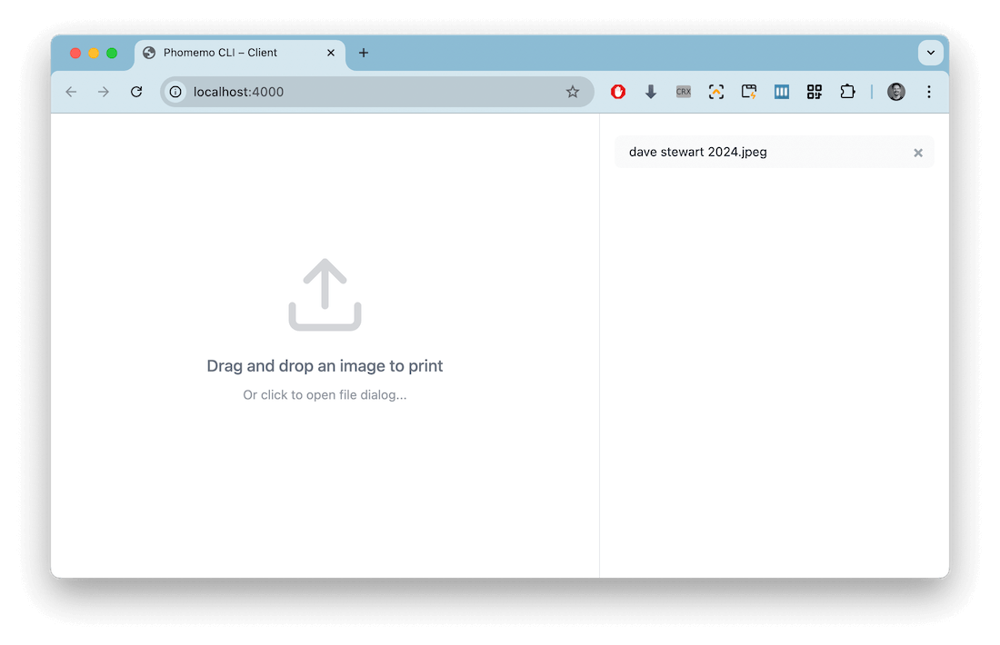
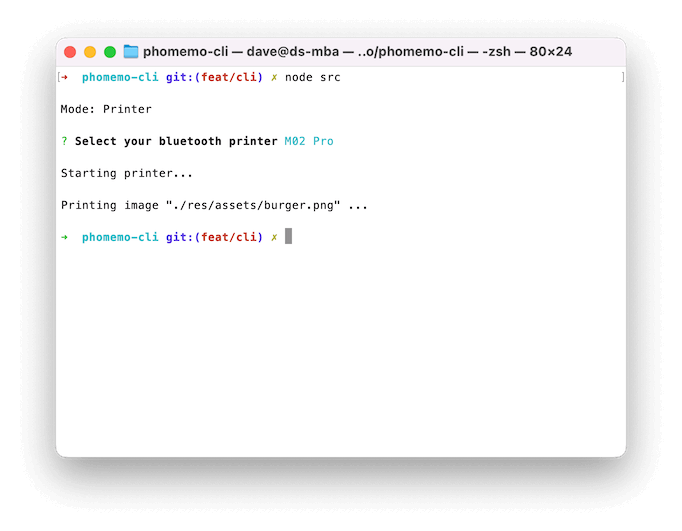

# Phomemo CLI

> A Node JS package to enabling printing to a Phomemo printer

## Overview

The [Phomemo M02 S/Pro](https://eu.phomemo.com/products/m02-pro-portable-printer) is pocket-sized, bluetooth thermal label printer:


This package enables you to print directly to the printer using Node JS, from both local files, or from the browser via a local Express server.

## Setup

### Bluetooth

For the package to connect to the printer over Bluetooth, OSX needs to give permissions to the application running Node JS. This will most likely be your Terminal app or your IDE. 

Navigate to **System Settings** > **Privacy & Security** > **Bluetooth**, and add any apps which will need to communicate with the printer.

> Note that you **should not** connect to the printer via Bluetooth settings – or else the CLI will be unable to find the printer.  

### Installation

Next, clone the repository directly from GitHub:

```bash
git clone git@github.com:davestewart/phomemo-cli.git
cd phomemo-cli
npm install
```

## Usage

Start the script by running it from the terminal.

Depending on what parameters you pass, it will run in one of two modes:

- [server](#server-mode) – where you print files by selecting them from a web browser
- [printer](#printer-mode) – where you print files one at a time from the terminal

For example:

```bash
# print an image
node src --file /path/to/file.png --dither

# start the web server
node src --port 4000 --cache
```

Running in server mode is generally the most user-friendly experience, as you can drag and drop images from your desktop, re-print files, delete files, etc.

## Server Mode



### Basic usage

To start the web server, pass the `--port` parameter with a port:

```bash
# simple ui
node src --port 4000

# file management ui
node src --port 4000 --cache
```

Alternatively, you can run one of the preconfigured NPM scripts:

```bash
# simple
npm run serve

# file management
npm run serve:cache
```

You can then visit `http://localhost:4000` in your browser to get started printing images.

### Developers

The print server is an Express app with just enough endpoints available to get the job done.

You can `POST` images from other applications to print directly to the printer.

You may pass CLI arguments as query strings, for example:

```
POST http://localhost:4000/print?scale=478&dither=1
```

Note that any CLI parameters and query string values will be combined in the final print function, so the following would print a dithered image at 50%:

```
// bash
node src --port 4000 --dither

// HTTP POST
http://localhost:4000/print?scale=50
```

## Printer Mode



### Basic usage

To print a single file, pass the `--file` parameter with a file path:

```bash
node src --file path/to/file.jpg
```

You can pass additional commands like so:

```bash
node src --file path/to/file.jpg --dither --debug
```

## CLI Reference

### Terminal commands

To work with the script directly, use the terminal:

```
# format
node src <option value>

#example
node src --port 4000 --cache --debug 
```

The script takes the following parameters:

```
device
  --device <device>  choose a named device (default: "")
  --no-device        skip choosing a device

server
  --port <port>      port to start print server

image
  --file <path>      path for image to print (default: "")
  --scale <size>     percent scale at which the image should print (1-100) (default: "100")
  --dither           flag to dither the passed image (default: false)

development
  --cache            maintain cache folder of printed images (default: false)
  --debug            maintain debug image folder and dump console logs (default: false)  
```

### NPM Scripts

To run preconfigured scripts, use npm:

```bash
# format
npm run <script>

# example
npm run serve:cache
```

The following scripts are available:

```
printer
  print           print a file directly (npm run print -- --file <path to file>)
  print:test      print a sample file

server
  serve           run the server 
  serve:cache     run the server cache files
  
server (development)
  serve:client    run the server with a cache, but without a printer
  serve:dev       run the server with cache, debugging, and 'M02 Pro' printer
```

## Image and label sizes

The printer's default label size is 53mm, with images expected to be 560px wide (or they will be resized to fit).

If you want to print on [smaller labels](https://www.amazon.co.uk/s?k=phomemo+labels) you will need to tweak the output image's scale, via either command line arguments or query parameters:

| Label Size     | Image Width | CLI     | Server      |
|----------------|-------------|---------|-------------|
| 53mm (default) | 560px       | None    | None        |
| 25mm           | 264px       | `-s 47` | `?scale=47` |
| 15mm           | 158px       | `-s 28` | `?scale=28` |

For example, to configure the server to the 25mm label:

```bash
node src --port 4000 --scale 47
```

## Troubleshooting

### Connection

It may take several attempts to find the printer:

```bash
> phomemo-cli@1.0.0 serve
> node src -p 4000

Operating as: server
? Select your bluetooth printer - Scan again
? Select your bluetooth printer - Scan again
? Select your bluetooth printer (Use arrow keys)
❯ M02 Pro
  - Scan again
  - Quit
```

If the printer does not show in the list, make sure:

- the printer is turned on
- the printer is not currently charging
- you did not connect to the printer using the system dialog
- you aren't running more than one script at the same time

If you know the name of the printer you want to connect to, pass its name to skip the menu:

```bash
node src --port 4000 --device 'M02 Pro'
```

### Battery

A flashing light on the printer then loss of power probably means that the printer needs charging.

Note that:

- the printer will only charge from a basic mobile phone charger, or a USB cable attached to a laptop
- attaching a more powerful charger (such as a laptop) will cause the printer not to charge
- you can use the Phomemo app to monitor the charge level

### Blank pages

Currently, there are issues with printer output, specifically around dithering. If you don't get any output, try running the package again with the `--debug` flag, then check the `res/debug` folder.

If the output image is empty, you may need to dither, or not dither.

Try running the print code, or server, again, using the `--dither` flag:

```bash
node src --file /path/to/file.png --dither
```

### Other printers

If you're not using the Phomemo M02S/Pro, you will need to edit `src/print.js` and change `BYTES_PER_LINE` to match your printer.

> Note that the value of `70` for the MO2 was determined through trial and error

## Credits

The [original repo](https://github.com/vrk/cli-phomemo-printer) and printing functionality was created by [Victoria Kirst](https://github.com/vrk) – thanks to the very helpful breadcrumbs left by:

- [vivier/phomemo-tools](https://github.com/vivier/phomemo-tools): lifesaver for having the protocol documented & providing the general algorithm
- [Phomemo Thermal Printing On MacOS](https://brainbaking.com/post/2023/02/phomemo-thermal-printing-on-macos/): gave me faith that this was even possible!

The additional server functionality, browser client, Sharp migration, code refactor and improved docs were added by [Dave Stewart](https://github.com/davestewart).
